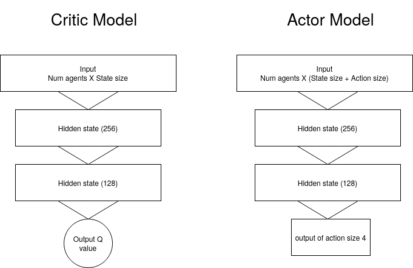

## Continuous Control

## Learning Algorithm

 - The code for DDPG was implemented with the help of udacity lecture material
 - Also referred to ShagtongZhang DRL library https://github.com/ShangtongZhang/DeepRL to debug my model


The following is the algorithm used from the paper https://arxiv.org/pdf/1509.02971.pdf


- Noise added to the deterministic actor was done using Ornstein–Uhlenbeck Noise
- Store the transition tuples in the replay buffer
- The model requires minimizing the Mean squared error between target and approximate Q value
- and maximizing the expected Q value while take deterministic actions using gradient ascent
- Soft update the models using TAU


## Chosen parameters and model architectures


| Parameters            | value |
| --------------------- | ----- |
| Replay buffer size    | 1e5   |
| batch size for models | 256   |
| GAMMA                 | 0.99  |
| TAU (soft update)     | 1e-3  |
| learning rate         | 1e-4  |
| Update every          | 2     |

## Models used for agents

For Actor

```reStructuredText
Actor Net(
  (fc1): Linear(in_features=33, out_features=256, bias=True)
  (fc2): Linear(in_features=256, out_features=128, bias=True)
  (fc3): Linear(in_features=128, out_features=4, bias=True)
)
```

For Critic

```reStructuredText
Critic Net(
  (fc1): Linear(in_features=33, out_features=256, bias=True)
  (fc2): Linear(in_features=256, out_features=128, bias=True)
  (fc3): Linear(in_features=128, out_features=1, bias=True)
)
```


# 

# Plots of Rewards


#### Environment was solved by 460 episodes! With an average score of 30


# Future Works

- Continue with exploring  PPO, D4PG and A3C models for the agents
- Solve the Reacher 20 option, I did try to solve it but it was extremely slow.
- Try solving the Crawler environment and also explore the agents in Gazebo
- Play around with different model architectures 
